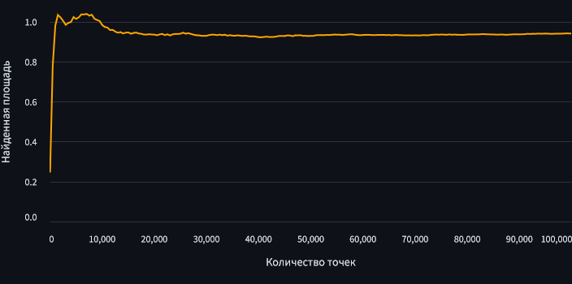
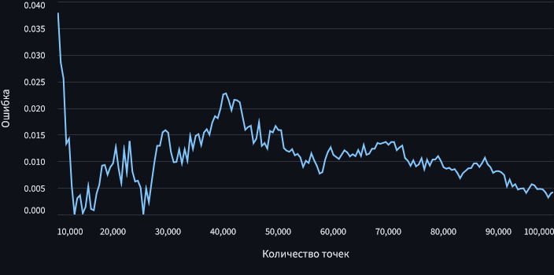
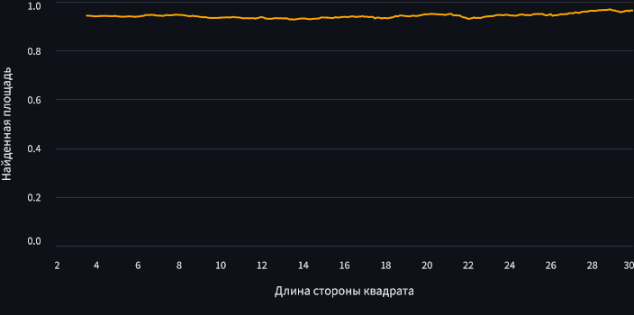

# Алгоритм Монте-Карло

#### 1. [Реализован](source/monte_carlo.cpp) алгоритм Монте-Карло на основе случайной генерации точек в заданной прямоугольной области для приближенного вычисления площади пересечения трех кругов, заданных координатами центров и радиусами.

* Изначально в качестве фигуры, внутри которой генерируются точки, выбран квадрат с координатами левого нижнего угла в (0; 0) и правого верхнего в (3.5; 3.5). Как видно из картинки, фигура, площадь которой нужно найти, полностью находится внутри выбранного квадрата.
* Выбранное количество точек: 1e8
* Результат:

#### 2. Выполнена визуализация экспериментов с параметрами
* Зависимость найденной алгоритмом площади от количества сгенерированных точек

* Зависимость модуля ошибки от количества сгенерированных точек

* Увеличенная правая часть предыдущего графика

* Зависимость найденной алгоритмом площади от длины стороны квадрата (длина стороны увеличивалась симметрично с шагом 0.1)

* Зависимость модуля ошибки от длины стороны квадрата (длина стороны увеличивалась симметрично с шагом 0.1)

#### 3. Описание результатов и выводы
* С помощью алгоритма Монте-Карло удалось вычислить площадь заданной области с погрешностью менее 5e-4.
* При маленьком количестве точек (до 10000) ошибка достаточно высокая, а затем резко снижается. Есть тенденция снижения ошибки и дальше с увеличением количества точек, но она снижается скачками.
* Если посмотреть на график зависимости найденной площади от длины стороны квадрата, кажется, что это значение почти не меняется. На самом деле это не так, ведь борьба идет за сотые, тысячные и меньше, просто это не очень заметно на этом графике.
* Более иллюстративен график зависимости модуля ошибки от длины стороны квадрата. Можно сделать вывод о том, что обычно, чем меньше длина квадрата (соответственно и его площадь), тем меньше ошибка. Однако ошибка снижается скачками при уменьшении длины стороны квадрата.
* Основной вывод: чем ближе площадь фигуры, внутри которой генерируются точки, к площади искомой фигуры (при этом искомая фигура должна быть полностью внутри той, в которой генерируются точки, иначе алгоритм становится некорректным) и чем больше точек генерируется, тем точнее будет найдена площадь.

#### 4. Другое
1. id посылки на codeforces: _[292393606](https://dsahse.contest.codeforces.com/group/NOflOR1Qt0/contest/565612/submission/292393606)_
2. [ссылка на репозиторий](https://github.com/seny03/monte-carlo)

